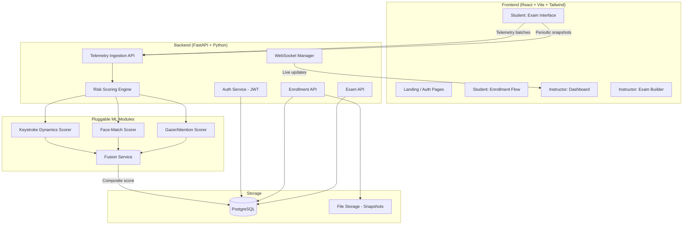

# SentinelExam — Implementation Plan

A privacy-preserving behavioral-biometric exam integrity platform that replaces continuous video proctoring with lightweight signals: keystroke dynamics, mouse movement patterns, and periodic webcam snapshots.

## User Review Required

> [!IMPORTANT]
> **TailwindCSS version**: You specified Tailwind CSS. I'll use **Tailwind CSS v3** with the Vite plugin. Confirm if you'd prefer v4 instead.

> [!IMPORTANT]  
> **Database seeding**: I'll create seed data (demo instructor + student accounts, sample exam with questions) so the app is immediately usable after `docker compose up`. Let me know if you'd prefer a clean-slate start.

> [!WARNING]
> **Face detection library**: The original `face-api.js` is abandoned (2020). I'll use **MediaPipe Face Detector** (`@mediapipe/tasks-vision`) for face detection + landmark extraction — it's Google-maintained, lightweight, and Vite-compatible. The gaze-direction heuristic will be built on top of MediaPipe's eye landmark positions (computing pupil-to-eye-corner ratios). This is the stub that a real gaze-tracking ML model would replace.

> [!WARNING]
> **No real ML models shipped**: All three scoring modules (keystroke, face-match, gaze) ship as **deterministic heuristic stubs** with a clearly documented `ScoringModelInterface` abstract base class. This is by design — your thesis work plugs real trained models into these interfaces.

## Open Questions

> [!IMPORTANT]
> **Exam question import**: Should the instructor be able to bulk-import questions (CSV/JSON), or is manual one-by-one creation sufficient for the MVP?

> [!IMPORTANT]
> **Snapshot storage**: Should webcam snapshots be stored as files on disk (simpler, Docker volume) or as base64 blobs in PostgreSQL? I'll default to **disk storage** (served via a protected endpoint) for performance.

> [!NOTE]
> **Real-time updates**: For the instructor dashboard, I'll use **WebSocket** connections (FastAPI native support) for live risk-score updates during active exams, with HTTP polling as a fallback. SSE was considered but WebSocket gives us bidirectional capability if needed later.

---

## Architecture Overview



---

## Project Folder Structure

```
SentinelExam/
├── docker-compose.yml
├── .env.example
├── README.md
│
├── frontend/
│   ├── index.html
│   ├── package.json
│   ├── vite.config.js
│   ├── tailwind.config.js
│   ├── postcss.config.js
│   ├── public/
│   │   └── favicon.svg
│   └── src/
│       ├── main.jsx
│       ├── App.jsx
│       ├── index.css                    # Tailwind directives + custom design tokens
│       ├── api/
│       │   ├── client.js                # Axios instance with JWT interceptor
│       │   └── endpoints.js             # All API endpoint functions
│       ├── hooks/
│       │   ├── useAuth.js               # Auth context hook
│       │   ├── useWebSocket.js          # WS connection hook
│       │   ├── useKeystrokeDynamics.js  # Captures dwell/flight times
│       │   ├── useMouseTracking.js      # Captures mouse path/velocity
│       │   └── useTabVisibility.js      # Captures tab-switch/blur events
│       ├── contexts/
│       │   └── AuthContext.jsx          # JWT auth state provider
│       ├── components/
│       │   ├── layout/
│       │   │   ├── Navbar.jsx
│       │   │   ├── Sidebar.jsx
│       │   │   └── ProtectedRoute.jsx
│       │   ├── ui/
│       │   │   ├── Button.jsx
│       │   │   ├── Card.jsx
│       │   │   ├── Modal.jsx
│       │   │   ├── Badge.jsx
│       │   │   ├── Tooltip.jsx
│       │   │   └── LoadingSpinner.jsx
│       │   ├── enrollment/
│       │   │   ├── ConsentScreen.jsx
│       │   │   ├── TypingBaseline.jsx
│       │   │   └── FaceCapture.jsx
│       │   ├── exam/
│       │   │   ├── ExamShell.jsx        # Timer, progress, telemetry orchestrator
│       │   │   ├── MCQQuestion.jsx
│       │   │   ├── FreeTextQuestion.jsx
│       │   │   ├── WebcamCapture.jsx    # Periodic snapshot component
│       │   │   └── TelemetryOverlay.jsx # Subtle indicator that monitoring is active
│       │   ├── dashboard/
│       │   │   ├── SessionList.jsx
│       │   │   ├── RiskTimeline.jsx     # Per-window risk score chart
│       │   │   ├── EvidencePanel.jsx    # Drill-down: snapshot + telemetry
│       │   │   ├── FlagActions.jsx      # Confirm/dismiss/escalate
│       │   │   └── ExamBuilder.jsx      # Create/edit exams
│       │   └── charts/
│       │       ├── RiskScoreGauge.jsx
│       │       └── TimelineChart.jsx
│       └── pages/
│           ├── LandingPage.jsx
│           ├── LoginPage.jsx
│           ├── RegisterPage.jsx
│           ├── student/
│           │   ├── EnrollmentPage.jsx
│           │   ├── ExamListPage.jsx
│           │   └── ExamPage.jsx
│           └── instructor/
│               ├── DashboardPage.jsx
│               ├── ExamManagePage.jsx
│               ├── SessionDetailPage.jsx
│               └── SettingsPage.jsx
│
├── backend/
│   ├── Dockerfile
│   ├── requirements.txt
│   ├── alembic.ini
│   ├── alembic/
│   │   ├── env.py
│   │   └── versions/                    # Migration files
│   └── app/
│       ├── main.py                      # FastAPI app entry, middleware, CORS
│       ├── config.py                    # Pydantic Settings (env vars)
│       ├── database.py                  # Async SQLAlchemy engine + session
│       │
│       ├── models/                      # SQLAlchemy ORM models
│       │   ├── __init__.py
│       │   ├── user.py                  # User (role: student | instructor)
│       │   ├── enrollment.py            # Enrollment baseline data
│       │   ├── exam.py                  # Exam + Question models
│       │   ├── session.py               # ExamSession (student taking an exam)
│       │   ├── telemetry.py             # TelemetryWindow (per-window features)
│       │   └── snapshot.py              # Snapshot metadata + file path
│       │
│       ├── schemas/                     # Pydantic request/response schemas
│       │   ├── __init__.py
│       │   ├── auth.py
│       │   ├── enrollment.py
│       │   ├── exam.py
│       │   ├── session.py
│       │   ├── telemetry.py
│       │   └── risk.py
│       │
│       ├── api/                         # Route handlers
│       │   ├── __init__.py
│       │   ├── deps.py                  # Dependency injection (get_db, get_current_user)
│       │   ├── auth.py                  # Login, register, token refresh
│       │   ├── enrollment.py            # Baseline capture + face photo upload
│       │   ├── exams.py                 # CRUD exams + questions
│       │   ├── sessions.py              # Start/submit exam session
│       │   ├── telemetry.py             # Batch telemetry ingestion
│       │   ├── snapshots.py             # Upload + serve protected snapshots
│       │   ├── dashboard.py             # Instructor dashboard queries
│       │   └── websocket.py             # WS endpoint for live updates
│       │
│       ├── services/                    # Business logic
│       │   ├── __init__.py
│       │   ├── auth_service.py          # Password hashing, JWT encode/decode
│       │   ├── enrollment_service.py
│       │   ├── exam_service.py
│       │   ├── session_service.py
│       │   └── telemetry_service.py     # Batches → DB, triggers scoring
│       │
│       ├── scoring/                     # ★ ML INTEGRATION POINTS ★
│       │   ├── __init__.py
│       │   ├── base.py                  # Abstract ScoringModelInterface
│       │   ├── keystroke_scorer.py      # Stub: statistical distance from baseline
│       │   ├── face_scorer.py           # Stub: cosine similarity of embeddings
│       │   ├── gaze_scorer.py           # Stub: off-screen ratio heuristic
│       │   └── fusion.py               # Weighted average combiner (configurable)
│       │
│       ├── tasks/                       # Background / async tasks
│       │   ├── __init__.py
│       │   ├── scoring_task.py          # Runs scoring pipeline per window
│       │   └── cleanup_task.py          # Snapshot retention / auto-delete
│       │
│       └── utils/
│           ├── __init__.py
│           └── file_storage.py          # Save/load snapshot files
│
└── seed/
    ├── seed_db.py                       # Create demo users + sample exam
    └── sample_passage.txt               # Enrollment typing passage
```

---

## Proposed Changes

### Phase 1 — Project Scaffolding & Docker

#### [NEW] [docker-compose.yml](file:///f:/Programs/SentinelExam/docker-compose.yml)
- Three services: `frontend` (Node 20), `backend` (Python 3.11), `db` (PostgreSQL 16)
- Shared network, volume mounts for development hot-reload
- Environment variable passthrough from `.env`

#### [NEW] [.env.example](file:///f:/Programs/SentinelExam/.env.example)
- `DATABASE_URL`, `JWT_SECRET`, `CORS_ORIGINS`, `SNAPSHOT_DIR`, `SNAPSHOT_RETENTION_DAYS`

---

### Phase 2 — Backend Foundation

#### [NEW] [requirements.txt](file:///f:/Programs/SentinelExam/backend/requirements.txt)
- Core: `fastapi`, `uvicorn[standard]`, `sqlalchemy[asyncio]`, `asyncpg`, `alembic`
- Auth: `python-jose[cryptography]`, `passlib[bcrypt]`
- Validation: `pydantic`, `pydantic-settings`
- ML stubs: `numpy`, `scipy` (for statistical distance in keystroke scorer)
- File handling: `python-multipart`, `aiofiles`
- WebSocket: built-in FastAPI

#### [NEW] [app/config.py](file:///f:/Programs/SentinelExam/backend/app/config.py)
- Pydantic `BaseSettings` loading from `.env`
- All scoring weights and thresholds configurable here

#### [NEW] [app/database.py](file:///f:/Programs/SentinelExam/backend/app/database.py)
- Async SQLAlchemy engine with `asyncpg` driver
- Async session factory with dependency injection pattern

#### [NEW] [app/models/](file:///f:/Programs/SentinelExam/backend/app/models/)
Key models:
| Model | Key Fields |
|-------|-----------|
| `User` | id, email, name, password_hash, role (student/instructor), created_at |
| `Enrollment` | user_id → User, keystroke_baseline (JSON), face_photo_path, enrolled_at |
| `Exam` | id, title, description, created_by → User, duration_minutes, settings (JSON) |
| `Question` | id, exam_id → Exam, type (mcq/freetext), body, options (JSON), correct_answer |
| `ExamSession` | id, student_id → User, exam_id → Exam, started_at, submitted_at, overall_risk_score, status (active/submitted/flagged/reviewed) |
| `TelemetryWindow` | id, session_id → ExamSession, window_start, window_end, keystroke_features (JSON), mouse_features (JSON), tab_events (JSON), keystroke_score, face_score, gaze_score, composite_score |
| `Snapshot` | id, session_id → ExamSession, window_id → TelemetryWindow, file_path, captured_at, face_detected (bool), gaze_direction (JSON) |

#### [NEW] [app/scoring/base.py](file:///f:/Programs/SentinelExam/backend/app/scoring/base.py) — ★ ML Integration Point
```python
from abc import ABC, abstractmethod
from typing import Any, Dict

class ScoringModelInterface(ABC):
    """Abstract interface for all scoring models.
    
    To integrate a trained ML model:
    1. Subclass this interface
    2. Implement score() with your model's inference logic
    3. Register your subclass in the scoring config
    """
    
    @abstractmethod
    async def score(
        self, 
        live_data: Dict[str, Any], 
        baseline_data: Dict[str, Any] | None = None
    ) -> float:
        """Return a risk score between 0.0 (normal) and 1.0 (anomalous)."""
        ...
    
    @abstractmethod
    def get_evidence(self) -> Dict[str, Any]:
        """Return human-readable evidence explaining the score."""
        ...
```

#### [NEW] [app/scoring/keystroke_scorer.py](file:///f:/Programs/SentinelExam/backend/app/scoring/keystroke_scorer.py) — ★ ML Integration Point 1
- **Stub implementation**: Computes mean dwell/flight times from live window, compares to enrollment baseline using normalized Euclidean distance
- Clear docstring: "Replace with trained model (e.g., one-class SVM, autoencoder on keystroke features)"

#### [NEW] [app/scoring/face_scorer.py](file:///f:/Programs/SentinelExam/backend/app/scoring/face_scorer.py) — ★ ML Integration Point 2
- **Stub implementation**: Receives face embedding vectors (from frontend MediaPipe), computes cosine similarity against enrollment embedding
- Clear docstring: "Replace with a fine-tuned face-verification model (e.g., FaceNet, ArcFace)"

#### [NEW] [app/scoring/gaze_scorer.py](file:///f:/Programs/SentinelExam/backend/app/scoring/gaze_scorer.py) — ★ ML Integration Point 3
- **Stub implementation**: Counts proportion of snapshots where gaze landmarks indicate looking away (pupil-to-corner ratio threshold)
- Clear docstring: "Replace with a gaze-estimation model (e.g., GazeNet, MPIIGaze)"

#### [NEW] [app/scoring/fusion.py](file:///f:/Programs/SentinelExam/backend/app/scoring/fusion.py)
- Weighted average: `composite = w1*keystroke + w2*face + w3*gaze`
- Weights configurable via `config.py`
- Stub marked as replaceable with learned fusion (e.g., logistic regression on score vector)

---

### Phase 3 — Auth & API Layer

#### [NEW] [app/api/auth.py](file:///f:/Programs/SentinelExam/backend/app/api/auth.py)
- `POST /api/auth/register` — role selection (student/instructor)
- `POST /api/auth/login` — returns JWT access + refresh tokens
- `POST /api/auth/refresh` — token refresh

#### [NEW] [app/api/enrollment.py](file:///f:/Programs/SentinelExam/backend/app/api/enrollment.py)
- `POST /api/enrollment/baseline` — receives keystroke timing array, stores as JSON
- `POST /api/enrollment/face-photo` — receives face image, stores to disk

#### [NEW] [app/api/exams.py](file:///f:/Programs/SentinelExam/backend/app/api/exams.py)
- Full CRUD for exams and questions (instructor only)
- `GET /api/exams` — student: list available exams; instructor: list own exams

#### [NEW] [app/api/telemetry.py](file:///f:/Programs/SentinelExam/backend/app/api/telemetry.py)
- `POST /api/telemetry/batch` — receives batched telemetry (keystroke + mouse + tab events + snapshot)
- Triggers async scoring pipeline per completed time window

#### [NEW] [app/api/dashboard.py](file:///f:/Programs/SentinelExam/backend/app/api/dashboard.py)
- `GET /api/dashboard/sessions` — paginated session list with risk scores
- `GET /api/dashboard/sessions/{id}/timeline` — per-window risk breakdown
- `POST /api/dashboard/sessions/{id}/action` — confirm/dismiss/escalate

#### [NEW] [app/api/websocket.py](file:///f:/Programs/SentinelExam/backend/app/api/websocket.py)
- WebSocket endpoint `/ws/dashboard/{exam_id}`
- Broadcasts new risk scores to connected instructors in real-time

---

### Phase 4 — Frontend Foundation

#### [NEW] Frontend scaffolding via Vite
```bash
npx -y create-vite@latest ./ --template react
```
- Install: `tailwindcss`, `postcss`, `autoprefixer`, `axios`, `react-router-dom`, `recharts`, `lucide-react`

#### [NEW] [src/index.css](file:///f:/Programs/SentinelExam/frontend/src/index.css)
Design system:
- **Dark mode first** with deep navy/charcoal background (#0B1120)
- **Accent palette**: Electric blue (#3B82F6) → violet (#7C3AED) gradient for primary actions
- Glassmorphism cards: `backdrop-blur-xl bg-white/5 border border-white/10`
- Custom glow/pulse animations for live monitoring indicators
- Typography: Inter (Google Fonts)

#### [NEW] [src/contexts/AuthContext.jsx](file:///f:/Programs/SentinelExam/frontend/src/contexts/AuthContext.jsx)
- JWT storage (localStorage), auto-refresh, role-based routing
- `useAuth()` hook exposing `user`, `login()`, `logout()`, `isStudent`, `isInstructor`

#### [NEW] [src/api/client.js](file:///f:/Programs/SentinelExam/frontend/src/api/client.js)
- Axios instance with base URL, JWT interceptor, refresh-on-401 logic

---

### Phase 5 — Enrollment Flow (Student)

#### [NEW] [ConsentScreen.jsx](file:///f:/Programs/SentinelExam/frontend/src/components/enrollment/ConsentScreen.jsx)
- Full-screen consent modal with clear bullets explaining what is collected
- Animated icons for each data type (keyboard, mouse, camera)
- Must accept before proceeding; acceptance logged with timestamp

#### [NEW] [TypingBaseline.jsx](file:///f:/Programs/SentinelExam/frontend/src/components/enrollment/TypingBaseline.jsx)
- Displays a passage (from backend config)
- Captures keydown/keyup timestamps using `performance.now()` for sub-ms precision
- Real-time progress bar showing typing completion
- Submits array of `{key, dwellTime, flightTime}` to backend

#### [NEW] [FaceCapture.jsx](file:///f:/Programs/SentinelExam/frontend/src/components/enrollment/FaceCapture.jsx)
- Camera preview with face-detection overlay (MediaPipe)
- Guides user to center face in frame
- Captures high-quality reference photo + face embedding
- Submits both to backend

---

### Phase 6 — Exam Interface (Student)

#### [NEW] [src/hooks/useKeystrokeDynamics.js](file:///f:/Programs/SentinelExam/frontend/src/hooks/useKeystrokeDynamics.js)
- Attaches to target input/textarea elements
- Records per-key `{code, dwellTime, flightTime, timestamp}` using `performance.now()`
- Handles auto-repeat filtering, multi-key overlaps
- Returns current window's feature array

#### [NEW] [src/hooks/useMouseTracking.js](file:///f:/Programs/SentinelExam/frontend/src/hooks/useMouseTracking.js)
- Samples mouse position at ~60Hz, computes path segments
- Tracks velocity, acceleration, idle periods, click patterns
- Returns per-window summary features

#### [NEW] [src/hooks/useTabVisibility.js](file:///f:/Programs/SentinelExam/frontend/src/hooks/useTabVisibility.js)
- `document.visibilitychange` + `window.blur/focus` listeners
- Logs each event with timestamp and duration

#### [NEW] [ExamShell.jsx](file:///f:/Programs/SentinelExam/frontend/src/components/exam/ExamShell.jsx)
- Orchestrates the exam: timer, question navigation, answer state
- Initializes all three telemetry hooks
- Manages periodic webcam snapshots (configurable 30–60s interval)
- Batches and sends telemetry to backend every 15 seconds
- Subtle, non-intrusive monitoring indicator (small pulsing dot)

#### [NEW] [WebcamCapture.jsx](file:///f:/Programs/SentinelExam/frontend/src/components/exam/WebcamCapture.jsx)
- Invisible periodic capture (no constant preview to reduce anxiety)
- Uses MediaPipe for face detection + landmark extraction on each snapshot
- Sends snapshot image + extracted landmarks/embedding to backend
- Visual flash indicator on capture (brief, subtle)

---

### Phase 7 — Instructor Dashboard

#### [NEW] [DashboardPage.jsx](file:///f:/Programs/SentinelExam/frontend/src/pages/instructor/DashboardPage.jsx)
- Header with exam selector dropdown
- Live session count + active monitoring indicator
- Filterable/sortable session table with risk badges (Low/Medium/High/Critical)
- WebSocket-powered real-time score updates (scores animate in)

#### [NEW] [RiskTimeline.jsx](file:///f:/Programs/SentinelExam/frontend/src/components/dashboard/RiskTimeline.jsx)
- Recharts area chart showing composite risk score over time windows
- Color-coded bands: green (0–0.3), yellow (0.3–0.6), orange (0.6–0.8), red (0.8–1.0)
- Clickable points → drills into specific window

#### [NEW] [EvidencePanel.jsx](file:///f:/Programs/SentinelExam/frontend/src/components/dashboard/EvidencePanel.jsx)
- Slide-out panel showing:
  - Webcam snapshot for the flagged window
  - Individual scorer breakdowns (keystroke/face/gaze scores with explanations)
  - Telemetry mini-charts (typing speed, mouse activity)
  - Tab-switch event log

#### [NEW] [FlagActions.jsx](file:///f:/Programs/SentinelExam/frontend/src/components/dashboard/FlagActions.jsx)
- Three action buttons: ✅ Dismiss, ⚠️ Escalate, 🚫 Confirm Flag
- Requires optional note/reason
- Updates session status via API

#### [NEW] [ExamBuilder.jsx](file:///f:/Programs/SentinelExam/frontend/src/components/dashboard/ExamBuilder.jsx)
- Create/edit exam with title, description, duration
- Add MCQ questions (with options + correct answer marking)
- Add free-text questions
- Configure risk thresholds and snapshot interval
- Drag-and-drop question reordering

#### [NEW] [SettingsPage.jsx](file:///f:/Programs/SentinelExam/frontend/src/pages/instructor/SettingsPage.jsx)
- Scoring weight configuration (keystroke/face/gaze weights)
- Risk threshold configuration
- Snapshot retention period setting
- Export session data (CSV)

---

### Phase 8 — Premium UI Polish

#### Design Enhancements
- **Landing page**: Animated hero with particle/mesh background, feature cards with hover effects, smooth scroll sections
- **Login/Register**: Split-screen layout with animated illustration side
- **Glassmorphism**: All cards use frosted glass effect on dark backgrounds
- **Micro-animations**: Button hover scales, card entrance animations, score counter animations, skeleton loading states
- **Risk score visualization**: Animated circular gauge with gradient fill (green → red)
- **Typography**: Inter font family, clear hierarchy (font weights 400/500/600/700)
- **Color palette**:
  - Background: `#0B1120` (deep space navy)
  - Surface: `#111827` / `#1F2937`
  - Primary: `#3B82F6` → `#7C3AED` gradient
  - Success: `#10B981`, Warning: `#F59E0B`, Danger: `#EF4444`
  - Text: `#F9FAFB` (primary), `#9CA3AF` (secondary)

---

### Phase 9 — Docker & Deployment

#### [NEW] [backend/Dockerfile](file:///f:/Programs/SentinelExam/backend/Dockerfile)
- Python 3.11 slim, multi-stage build
- Installs requirements, copies app code
- Runs with uvicorn

#### [NEW] [frontend/Dockerfile](file:///f:/Programs/SentinelExam/frontend/Dockerfile)
- Node 20, builds Vite app, serves with nginx

#### [NEW] [docker-compose.yml](file:///f:/Programs/SentinelExam/docker-compose.yml)
- `db`: PostgreSQL 16 with health check
- `backend`: Depends on db, auto-runs migrations
- `frontend`: Depends on backend, proxies API calls
- Development overrides for hot-reload

---

## Enhancements Beyond the Brief (Taking It to the Next Level)

I'm adding these to make this genuinely impressive for a thesis project:

1. **Bandwidth Analytics Dashboard** — A dedicated page showing measured bandwidth consumption per exam session vs. a simulated continuous-video baseline. This directly supports your thesis's privacy-vs-accuracy tradeoff analysis.

2. **Anomaly Heatmap** — On the instructor's session detail page, a time-based heatmap showing which scoring signals triggered at which moments, making patterns visible at a glance.

3. **Student Self-Review** — After exam submission, students can see their own session summary (without raw scores) — transparency builds trust.

4. **Exam Proctoring "Dry Run"** — Students can do a 2-minute practice session before the real exam to verify their webcam, typing capture, and connectivity are working.

5. **Session Comparison View** — Instructor can compare two student sessions side-by-side to spot coordinated cheating patterns.

6. **Export & Reporting** — One-click CSV/PDF export of session data, suitable for academic integrity committees.

---

## Verification Plan

### Automated Tests
```bash
# Backend unit tests
cd backend && python -m pytest tests/ -v

# Frontend build verification  
cd frontend && npm run build
```

### Manual Verification
1. **Docker smoke test**: `docker compose up` → all services healthy
2. **Full enrollment flow**: Register student → consent → typing baseline → face capture
3. **Exam flow**: Create exam (instructor) → start exam (student) → verify telemetry appears in DB → submit
4. **Risk scoring**: Verify composite scores appear on instructor dashboard within seconds of telemetry ingestion
5. **WebSocket**: Open dashboard in two tabs → verify real-time score updates
6. **Snapshot lifecycle**: Verify snapshots are captured, stored, viewable in evidence panel, and deleted after retention period
7. **Edge cases**: Tab switch during exam → verify event logged; no webcam → verify graceful degradation with warning

### Thesis-Specific Verification
- Measure and log payload sizes for telemetry batches vs. estimated video stream equivalent
- Record false-positive rate on stub scorers with baseline typing data
- Document all pluggable interface boundaries for the thesis write-up
